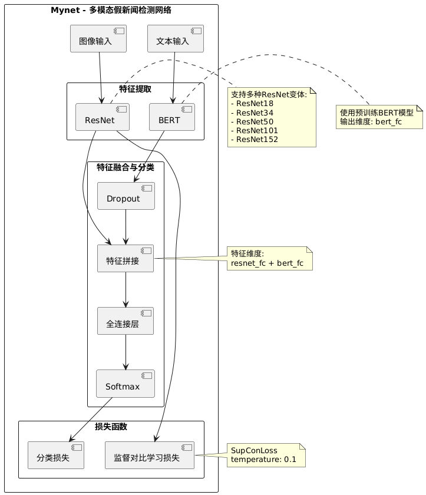

# 多模态假新闻检测系统


基于深度学习的多模态（文本+图像）中文假新闻检测系统，结合BERT和ResNet实现高精度假新闻识别。

## 项目简介

本项目旨在通过分析新闻文本内容和相关图像的特征，自动识别和分类真实新闻（标签0）与虚假新闻（标签1）。项目创新性地结合了BERT文本编码和ResNet图像特征提取，并通过对比学习方法提升模型性能，实现了高效准确的假新闻检测。

## 技术特点

- 🔄 **多模态融合**：同时处理文本和图像数据，提取更全面的特征
- 📝 **BERT文本编码**：使用预训练中文BERT模型处理文本信息
- 🖼️ **ResNet图像特征**：使用ResNet系列模型提取图像特征
- 🎯 **对比学习**：通过对比学习增强模型表示能力
- ⚙️ **灵活配置**：支持多种BERT和ResNet模型组合，便于实验对比

## 数据集介绍

项目使用了包含9528条带有图像的中文微博数据，分为真实新闻和假新闻两类：

- 每条数据包含微博文本和对应图像
- 文本数据经过BERT tokenizer处理
- 图像数据统一调整为224×224大小

数据集格式：
```
path,text,label
./data/images/xxx.jpg,新闻文本内容,1
```

## 模型架构

### 多模态融合模型

下图展示了本项目的模型整体架构：



项目实现了基于BERT和ResNet的多模态融合模型，主要组件包括：

1. **文本特征提取**：
   - 支持三种BERT模型：
     * `bert-base-chinese`
     * `chinese-bert-wwm-ext`
     * `minirbt-h256`

2. **图像特征提取**：
   - 支持五种ResNet模型：
     * `resnet18`
     * `resnet34`
     * `resnet50`
     * `resnet101`
     * `resnet152`

3. **特征融合与分类**：
   - 将BERT特征和ResNet特征融合
   - 通过全连接层映射到同一特征空间
   - 使用对比学习优化特征表示
   - 输出二分类结果（真/假新闻）

### 对比学习

当`config.usesloss=True`时，模型同时使用交叉熵损失和对比学习损失：
- 交叉熵损失用于分类任务
- 对比学习损失用于增强特征表示
- 最终损失为两者的平均值

## 项目结构

```
Fake-News/
├── config.py                # 配置文件
├── data_pro.py              # 数据预处理
├── models.py                # 模型定义
├── resnet_models.py         # ResNet模型实现
├── train.py                 # 模型训练和预测
├── utils.py                 # 工具函数
├── data/                    # 数据文件
│   ├── readme.txt           # 数据集说明
│   ├── test.csv             # 测试集
│   ├── train.csv            # 训练集
│   ├── val.csv              # 验证集
│   └── images/              # 图像文件夹
└── bert_model/              # 预训练BERT模型
    ├── bert-base-chinese/
    ├── chinese-bert-wwm-ext/
    └── minirbt-h256/
```

## 配置说明

主要配置参数（在`config.py`中）：

```python
# 训练参数
self.num_epochs = 20      # 训练轮数
self.batch_size = 32      # 批次大小
self.pad_size = 128       # 文本最大长度

# 学习率设置
self.bert_learning_rate = 1e-5    # BERT学习率
self.resnet_learning_rate = 2e-5  # ResNet学习率
self.other_learning_rate = 2e-5   # 其他层学习率

# 模型选择
self.bert_name = 'bert_model/minirbt-h256'  # BERT模型类型
self.resnet_name = 'resnet18'               # ResNet模型类型
self.usesloss = True                        # 是否使用对比学习
```

## 使用方法

### 环境配置

```bash
# 安装依赖
pip install torch torchvision transformers pandas numpy pillow opencv-python tensorboardX
```

### 数据预处理

```bash
# 处理原始数据
python data_pro.py
```

### 训练模型

```bash
# 使用默认配置训练
python train.py
```

### 修改配置

可以在`config.py`中修改以下参数进行实验：
- 更改BERT模型：修改`self.bert_name`
- 更改ResNet模型：修改`self.resnet_name`
- 调整学习率：修改`self.bert_learning_rate`等参数
- 开关对比学习：修改`self.usesloss`

## 评估指标

- 准确率（Accuracy）
- 分类报告（Classification Report）
- 损失曲线（通过TensorBoard可视化）

## 运行要求

- Python 3.8+
- PyTorch 1.10+
- Transformers 4.0+
- CUDA支持（推荐用于加速训练）
- 至少8GB显存（对于较大模型如ResNet101）

## 注意事项

- 首次运行需要下载预训练的BERT模型
- 深度学习模型需要较高的计算资源
- 对于`minirbt-h256`模型，建议使用更大的学习率（如1e-4）

## License

本项目采用MIT许可证。详情请参阅LICENSE文件。
